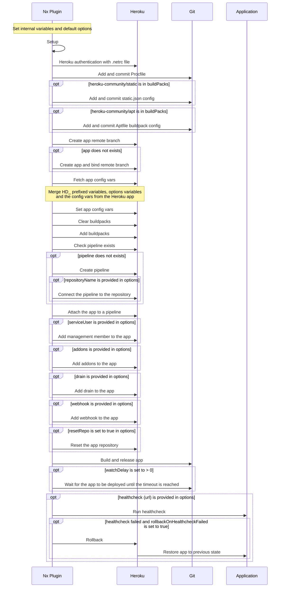

❤


[](https://sonarcloud.io/summary/new_code?id=getlarge_nx-heroku)

# nx-heroku

This plugin allows you to deploy any Nx application to Heroku. It is based on the [Heroku CLI](https://devcenter.heroku.com/articles/heroku-cli) and should help you to achieve simple or complex deployments.

- It supports multi-procfile buildpacks so that each app in your Nx workspace can be deployed to a different Heroku app.
- It supports Heroku pipelines and multi-stage deployments (development, staging, production) for each app.
- It can be used in CI/CD pipelines (Github Actions, Gitlab CI, etc) or locally to deploy your apps to Heroku.
- It can create Heroku apps, addons, webhooks and drains automatically if they don't exist.

## Setup

To deploy your application to Heroku, you need to have the [Heroku CLI](https://devcenter.heroku.com/articles/heroku-cli) installed.
In Github Actions, it comes already installed in the runners.

When running the executor, it will authenticate to Heroku with the credentials (`email`, `apiKey`) provided via the executors options.

To install the plugin, run the following command:

```bash
# with npm
npm install -D @aloes/nx-heroku

# or with yarn
yarn add -D @aloes/nx-heroku
```

## Generate target

### Deploy

To generate a target for your application, run the following command:

```bash
npx nx generate @aloes/nx-heroku:deploy --projectName=my-app --org=your-heroku-team --appNamePrefix=your-app-prefix

# or to be prompted for the project name, omit specifying it
npx nx g @aloes/nx-heroku:deploy

```

This will generate a `deploy` target in your `project.json` file.

### Promote

To generate a target for your application, run the following command:

```bash
npx nx generate @aloes/nx-heroku:promote --projectName=my-app --org=your-heroku-team --appNamePrefix=your-app-prefix

# or to be prompted for the project name, omit specifying it
npx nx g @aloes/nx-heroku:promote

```

This will generate a `promote` target in your `project.json` file.

## Execute target

### Deploy

The [`nx-heroku:deploy`](./packages/nx-heroku/src//executors/deploy/executor.ts) executor allows to deploy an Nx application to a targeted Heroku app. The deployment will be done for each pipeline stage declared via the option `config` (default: ['development'])

You can have a look at the [schema](./packages/nx-heroku/src/executors/deploy/schema.json) of the executor to see all the options available.

When deploying an application, the following steps are executed:

1. Set internal variables which are prefixed with HD to avoid conflicts with variables provided by the user (`variables` option)
2. Authentification to Heroku via .netrc file
3. Set default options (branch to current branch, environment to development, watchDelay to 0)
4. Set the Heroku app name.
   The Heroku app will be named after the pattern described in [Conventions](#naming-conventions).
5. Create project 'Procfile'
6. Create static buildpack config (optional)
7. Create 'Aptfile', to install extra Ubuntu dependencies before build (optional)
8. Ensure remote is added (and that application created).
9. Merge `HD_` prefixed variables with the one provided in the options and set Heroku app `config vars`.
   You can provide your own variables prefixed by `HD_`, they will be added (without the prefix) to the Heroku app config automatically.
   The environment variables `HD_PROJECT_NAME`,`HD_PROJECT_ENV`, `HD_NODE_ENV` and `HD_PROCFILE` will automatically be defined based on the project name and environment being deployed.
   `PROCFILE` is required when using [multi-procfile buildpack](https://elements.heroku.com/buildpacks/heroku/heroku-buildpack-multi-procfile), it should be defined in each Heroku app to indicate the Procfile path for the given project.
10. Cleanup and register buildpacks.
    Extra buildpacks can be provided by using `buildPacks` option, they will be installed in **the order they are provided in the array**.
11. Ensure app is attached to a pipeline with a stage matching the environment provided in options
    If the Heroku app doesn't exist, it will be created and attach to an existing or new pipeline.
12. Assign management member (optional)
13. Register addons (optional)
14. Register drain (optional)
15. Register webhook (optional)
16. Deploy (trigger build and release)
17. Run healthcheck (optional)
18. Rollback if healthcheck failed (optional)



### Example

For the given example project config:

```json
{
  "name": "frontend",
  "$schema": "../../node_modules/nx/schemas/project-schema.json",
  "projectType": "application",
  "sourceRoot": "apps/frontend/src",
  "targets": {
    ...,
    "deploy": {
      "executor": "@aloes/nx-heroku:deploy",
      "options": {
        "appNamePrefix": "aloes",
        "procfile": "web: bin/start-nginx-solo",
        "buildPacks": [
          "heroku/nodejs",
          "heroku-community/multi-procfile",
          "heroku-community/nginx"
        ],
        "variables": {
          "NGINX_APP_ROOT": "dist/apps/frontend",
          "YARN2_SKIP_PRUNING": "true"
        },
        "useForce": true,
        "debug": true
      }
    },
  }
}

```

You can run the deployment with :

```bash
export HEROKU_API_KEY=<your_heroku_api_key>
export HEROKU_EMAIL=<your_heroku_account_email>

#  this will build and release the applications `my-app-frontend-development` and `my-app-frontend-staging` to Heroku
npx nx run frontend:deploy --config 'development,staging' --appPrefixName my-app --apiKey $HEROKU_API_KEY --email $HEROKU_EMAIL
```

### Promote

The [`nx-heroku:promote`](./packages/nx-heroku/src//executors/promote/executor.ts) executor allows to promote an existing Heroku app from a pipeline. The promotion will be done for each pipeline stage declared via the option `config` (default: 'staging')

The promotion can be done :

- from development to staging by setting the config to 'staging',
- from staging to production by setting the config to 'production'

When promoting an application, the following steps are executed:

1. Check that pipeline exists
2. Check that the app to promote is attached to the pipeline, if not create it and attach it.
3. Merge config vars from the promoted app with the `variables` option.
4. Promote the app to the next stage
5. Assign management member (optional)

You can run the promotion with :

```bash
export HEROKU_API_KEY=<your_heroku_api_key>
export HEROKU_EMAIL=<your_heroku_account_email>

#  this will promote the application `my-app-frontend-development` to `my-app-frontend-staging` to Heroku
npx nx run frontend:promote --config staging --appPrefixName my-app --apiKey $HEROKU_API_KEY --email $HEROKU_EMAIL
```

<code> <b>Beware with frontend applications, the app is not being rebuilt so variables set in the build from down stream stage are used. </b> </code>

## Naming conventions

### Pipeline name

The pipeline name deployed on Heroku is composed with the pattern `${appPrefixName}-${projectName}`, where :

- `appPrefixName` is the prefix name of the Heroku app, it can be customized via the `appNamePrefix` option.
- `projectName` is the name of the Nx project.

Examples:

- `aloes-my-service`
- `aloes-frontend`

### Application name

The application names deployed on Heroku are composed with the pattern `${appPrefixName}-${projectName}-${environment}`, where :

- `appPrefixName` is the prefix name of the Heroku app, it can be customized via the `appNamePrefix` option.
- `projectName` is the name of the Nx project.
- `environment` is the Heroku pipeline stage (development, staging or production), it can be customized via the `config` option.

Due to some length limitations (32 characters), the environment name is shortened and the application name might be shortened as well.

Examples:

- `aloes-my-service-dev`
- `aloes-frontend-staging`
- `aloes-myapp-prod`

This logic is applied in this [Heroku helpers module](./packages/nx-heroku/src/executors/common/heroku/apps.ts)

---

## Hooks

Heroku allows to run scripts called during the deployment process, for node projects we can make use of package.json scripts to run these hooks.
See the [Heroku documentation](https://devcenter.heroku.com/articles/nodejs-support#customizing-the-build-process) for more details.

For example, we can use the `heroku-postbuild` script to provide our own application build process.

```json
{
  "scripts": {
    "heroku-postbuild": "node tools/heroku/postbuild.js $PROJECT_NAME $PROJECT_ENV",
    "heroku-cleanup": "node tools/heroku/cleanup.js $PROJECT_NAME $PROJECT_ENV"
  }
}
```

I will provide some examples based on my experience with Nx apps deployment on Heroku.

### Custom build process

The `heroku-postbuild` script is used to build the application, it is executed after the `npm install` command.

`tools/heroku/postbuild.js`

```js
const { createPackageJson, createLockFile } = require('@nrwl/devkit');
const { execSync } = require('child_process');
const { writeFileSync } = require('fs');

async function refreshPackageJson(implicitDeps = [], skipDev = false) {
  const projectGraph = await createProjectGraphAsync();
  const { root: projectRoot } = data;
  const options = {
    projectRoot: data.root,
    root: process.cwd(),
  };
  const packageJson = createPackageJson(projectName, projectGraph, options);
  for (const dep of implicitDeps) {
    packageJson.dependencies[dep] =
      rootPackageJson.dependencies[dep] || rootPackageJson.devDependencies[dep];
  }
  if (skipDev) {
    delete packageJson.devDependencies;
  }
  // we could sort dependencies here
  // packageJson.dependencies = sortObjectByKeys(packageJson.dependencies);
  // packageJson.devDependencies = sortObjectByKeys(packageJson.devDependencies);
  const packageJsonPath = `apps/${projectName}/package.json`;
  existsSync(packageJsonPath) && unlinkSync(packageJsonPath);
  writeFileSync(packageJsonPath, JSON.stringify(packageJson, null, 2));

  // generate and store lock file
  execSync(`npm i --prefix apps/${projectName} --package-lock-only`, {
    stdio: 'inherit',
  });
  // or when using nx >= 15.x
  const lockFile = createLockFile(packageJson);
  const packageLockJsonPath = `apps/${projectName}/package-lock.json`;
  writeFileSync(packageLockJsonPath, lockFile);
}

async function postbuild(argv) {
  const projectName = argv[2] || process.env.PROJECT_NAME;
  const projectEnv = argv[3] || process.env.PROJECT_ENV || 'production';
  const implicitDeps = (argv[4] || process.env.IMPLICIT_DEPS || '').split(',');
  console.log(`Heroku custom postbuild hook, ${projectName}:${projectEnv}`);
  // refresh package-lock to be reused in cleanup phase
  await refreshPackageJson(implicitDeps, true);

  execSync(`npx nx build ${projectName} --c ${projectEnv} `, {
    stdio: 'inherit',
  });
}

postbuild(process.argv).catch((e) => {
  console.error(e);
  process.exit(1);
});
```

### Custom cleanup

The `heroku-clean` script is used to cleanup the application before the deployment, it is executed after the `heroku-postbuild` script.
In this case we can remove the `node_modules` folder and only install the given project dependencies to respect the slug size limitation.

`tools/heroku/cleanup.js`

```js
/* eslint-disable @typescript-eslint/no-var-requires */
const { execSync } = require('child_process');
const { copyFileSync, existsSync, rmSync, writeFileSync } = require('fs');
const { resolve } = require('path');

function cleanup(argv) {
  const projectName = argv[2] || process.env.PROJECT_NAME;
  const projectEnv = argv[3] || process.env.PROJECT_ENV;
  console.log(`Heroku custom cleanup hook, ${projectName}:${projectEnv}`);
  // optionally you can authenticate on NPM here if you need to install private packages
  const npmrc = resolve(process.cwd(), '.npmrc');
  const registryUrl = `//registry.npmjs.org/`;
  const authString =
    registryUrl.replace(/(^\w+:|^)/, '') + ':_authToken=${NPM_TOKEN}';
  const contents = `${authString}${os.EOL}`;
  writeFileSync(npmrc, contents);

  const packageJsonPath = 'package.json';
  const packageLockJsonPath = 'package-lock.json';
  // declare package and package-lock json file paths generated at postbuild phase
  const appPackageJsonPath = `apps/${projectName}/${packageJsonPath}`;
  const appPackageLockJsonPath = `apps/${projectName}/${packageLockJsonPath}`;
  // remove all project dependencies and cache to respect slug size limitation
  if (existsSync('node_modules')) {
    rmSync('node_modules', { recursive: true, force: true });
  }
  if (existsSync('.yarn/cache')) {
    rmSync('.yarn/cache', { recursive: true, force: true });
  }

  // only backend apps should have generated a custom package.json
  if (existsSync(appPackageJsonPath)) {
    console.log('Found generated package.json');
    // reinstall production deps only
    copyFileSync(appPackageJsonPath, packageJsonPath);
    if (existsSync(appPackageLockJsonPath)) {
      copyFileSync(appPackageLockJsonPath, packageLockJsonPath);
      console.log(`Install dependencies with "npm ci"`);
      execSync('npm ci --production --loglevel=error', { stdio: 'inherit' });
    } else {
      console.log(`Install dependencies with "npm install"`);
      execSync('npm install --production --loglevel=error', {
        stdio: 'inherit',
      });
    }

    // try to remove unnecessary dependencies
    console.log(
      `Install and run node-prune | https://github.com/tj/node-prune`
    );
    execSync('curl -sf https://gobinaries.com/tj/node-prune | PREFIX=. sh');
    execSync('./node-prune', { stdio: 'inherit' });
    rmSync('node-prune');
  }
  // remove .npmrc file if exists
  rmSync('.npmrc');
}

cleanup(process.argv);
```
